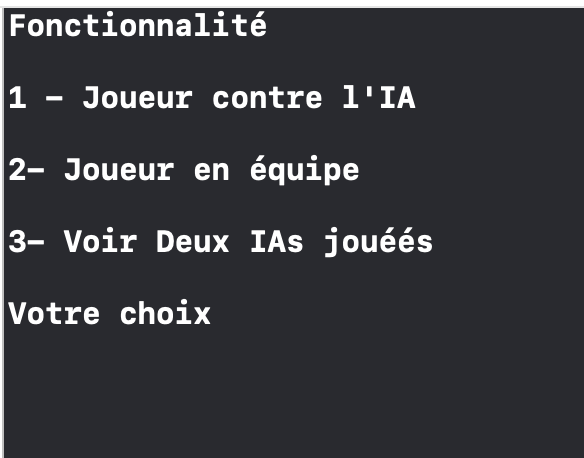
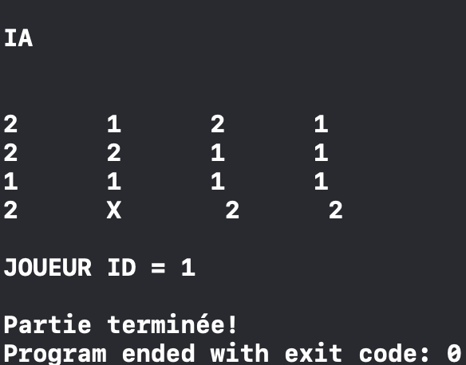

# PUISSANCE 4
Ce programme en Swift correspond à une implémentation d'un jeu. Il permet à l'utilisateur de choisir entre trois options de jeu en utilisant la fonction Outputer.printFirst(). En fonction de son choix (1, 2 ou 3), différentes logiques de jeu seront exécutées.

## DEMARRAGE

Ce programme est constitué essentiellement de deux composants à savoir : le package <b>BoardPackage<b/> des classes utilisées et l'application console <b>BoardConsole<b/> pour tester le jeux puissance 4

# CHOIX
Option 1: "Jouer contre l'IA"

    La fonction Outputer.printNom() est appelée pour obtenir le nom du joueur humain.
    Le joueur humain joue contre l'IA en utilisant une instance de la classe Human pour le joueur humain et une instance de la classe IA pour l'IA.
    Le plateau de jeu est créé en utilisant la classe Board avec les nombres de colonnes et de lignes déterminés par les fonctions Outputer.printNbColumn() et Outputer.printNbLigne().
    Enfin, une instance de la classe Game est créée avec le plateau de jeu et les deux joueurs, et la méthode play() est appelée pour démarrer la partie.

Option 2: "Jouer en équipe"

    Le nombre de joueurs humains est déterminé par la fonction Outputer.printNbPlayers().
    Pour chaque joueur, la fonction Outputer.printNom() est appelée pour obtenir son nom. Chaque joueur humain est créé en utilisant une instance de la classe Human.
    Le plateau de jeu est créé en utilisant la classe Board avec les nombres de colonnes et de lignes déterminés par les fonctions Outputer.printNbColumn() et Outputer.printNbLigne().
    Enfin, une instance de la classe Game est créée avec le plateau de jeu et les joueurs humains, et la méthode play() est appelée pour démarrer la partie.

Option 3: "IA contre IA"

    Le plateau de jeu est créé en utilisant la classe Board avec les nombres de colonnes et de lignes déterminés par les fonctions Outputer.printNbColumn() et Outputer.printNbLigne().
    Deux instances de la classe IA sont créées, une pour chaque joueur.
    Enfin, une instance de la classe Game est créée avec le plateau de jeu et les deux joueurs IA, et la méthode play() est appelée pour démarrer la partie.

# CAPTURE
   
   